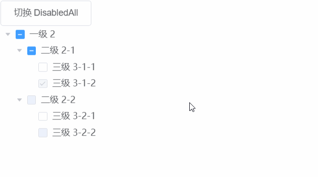

# ElementUI 之 Tree 组件切换全局 disabled

> 到 ElementUI 2.4.8 为止，Tree 组件还不能一次性控制所有节点是否可选，这里做了实验性的尝试，在切换全局 disabled 的同时，保留每个节点原本的 disabled 状态，做到可恢复。

效果图：



```vue
<template>
  <div>
    <el-button @click="disabledAll = !disabledAll">切换 DisabledAll </el-button>
    <!-- 使用 computed 方式包装 data -->
    <el-tree
      :data="filtedData"
      show-checkbox
      node-key="id"
      :default-expanded-keys="[2, 3]"
      :default-checked-keys="[5]">
    </el-tree>
  </div>
</template>

<script>
// 用于递归遍历节点，并执行回调处理
const R = (f, s) => s.map(i => (
  f(i), i.children && i.children.length ? R(f, i.children):0, i
))

export default {
  data() {
    return {
      // 全局 disabled 开关
      disabledAll: false,
      data: [{
        id: 1,
        label: '一级 2',
        children: [{
          id: 3,
          label: '二级 2-1',
          children: [{
            id: 4,
            label: '三级 3-1-1'
          }, {
            id: 5,
            label: '三级 3-1-2',
            disabled: true
          }]
        }, {
          id: 2,
          label: '二级 2-2',
          disabled: true,
          children: [{
            id: 6,
            label: '三级 3-2-1'
          }, {
            id: 7,
            label: '三级 3-2-2',
            disabled: true
          }]
        }]
      }],
      defaultProps: {
        children: 'children',
        label: 'label'
      }
    };
  },
  computed: {
    // 包装原 data，根据全局 disabled 开关，自动设置和清理子节点 disabled 状态
    // 使用 _disabled 存储原 disabled 值，在全局 disabled 关闭时恢复状态
    filtedData() {
      if (this.disabledAll) {
      	// 包装，启用 _disabled 存储 disabled
        return R(i => {
          if (i._disabled===undefined) {
            i._disabled = i.disabled===undefined ? false:i.disabled
          }
          i.disabled = true
          }, this.data)
      } else {
        // 恢复 disabled，清理 _disabled
        R(i => {
          if (i._disabled!=undefined) {
            i.disabled = i._disabled
            delete i._disabled
          }
        }, this.data)
        return this.data
      }
    }
  }
}
</script>
```

[在线运行](https://jsfiddle.net/cnine/uzves28p/)
