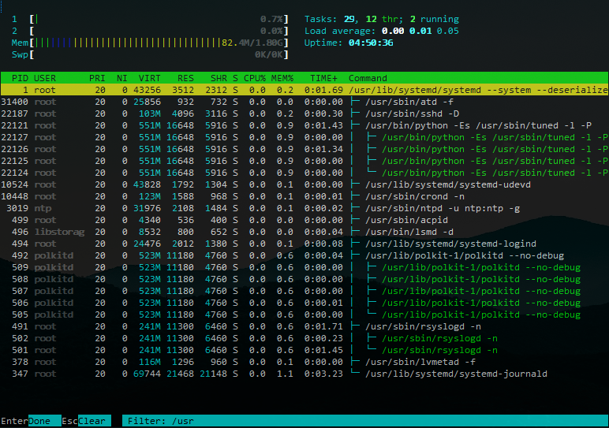
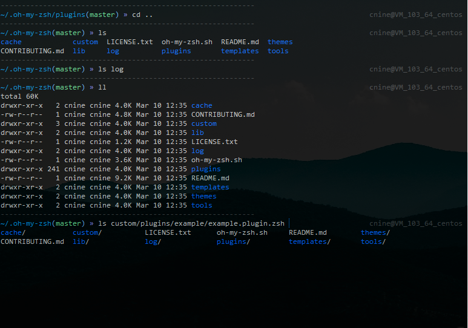
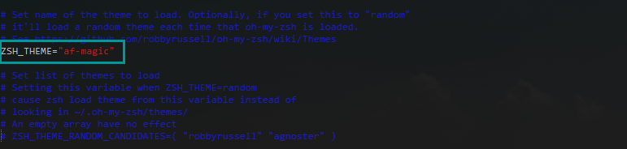
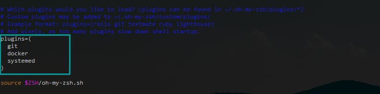

# CentOS 7 安装小记

<BuddyLogo who="centos" />

使用 CentOS 有一段时间了，作为服务器再好不过，这里记下入门操作，以及常用的软件安装，以云服务器为例。不足之处待指正。

## 准备工作

- 本地 Windows，用 git-bash，用其自带的 ssh 来登录 CentOS
- 某云 2 核 2G 云主机，50G 硬盘，*要买标准主机，别买什么建站专用啥的，除非你愿意*
- 云平台提供 CentOS 7 镜像，选最新版即可，*通常植入了监控程序，酌情选择*
- 设置好 root 密码，搓搓手，云平台自动安装好，记下服务器公网 IP

有公网 IP，现在就可以直接登录，打开 git-bash 输入：

```bash
ssh root@主机IP
```

*如果 ssh 登录失败，并出现 `know host` 字眼的错误，需要删除本地用户目录下 `.ssh/known_hosts` 文件。*

第一次访问：

```
Are you sure you want to continue connecting (yes/no)?
```

输入 `yes` 按回车确定，再输入密码。

## 初始操作

### 更改用户

root 用户位高权重，误操作或被盗，后果很严重，第一步就应该新建小用户。

可选择自己喜欢的昵称，这里以 cnine 用户名为例：

```bash
useradd cnine
```

设置新用户的登录密码：

```bash
passwd cnine
```

关闭 root 的 ssh 登录，使用 `vim /etc/ssh/sshd_config ` 编辑配置文件，找到这一段：

```ini
#PermitRootLogin yes
```

把包含 `PermitRootLogin` 这一行改为 `PermitRootLogin no` ，注意删除 `#` 符号，保存，重启 ssh 服务：

```bash
service sshd restart
```

现在 root 用户就无法直接登录，只能先登录普通用户，通过 `su` 命令，输入 root 密码切换至 root 用户。

### 更新安装源

先备份旧源：

```bash
mv /etc/yum.repos.d/CentOS-Base.repo /etc/yum.repos.d/CentOS-Base.repo.backup
```

直接上国内大厂的源，[在此](https://opsx.alibaba.com/mirror)，暴力添加：

```bash
wget -O /etc/yum.repos.d/CentOS-Base.repo http://mirrors.aliyun.com/repo/Centos-7.repo
```

或者：

```bash
curl -o /etc/yum.repos.d/CentOS-Base.repo http://mirrors.aliyun.com/repo/Centos-7.repo
```

还差 EPEL 源，*有旧的也可以先备份* ：

```bash
wget -O /etc/yum.repos.d/epel.repo http://mirrors.aliyun.com/repo/epel-7.repo
```

添加好了所有源，执行 `yum makecache` 生成缓存，现在大部分软件就可以开始装了。

### 更新软件

**注意！如果是公家的服务器，千万不要手贱去更新！**

用 root 用户进行更新，包管理器 yum 需要 root 的权限。

暴力更新：

```bash
yum upgrade -y
```

亦可使用 `yum update -y` ，只是更新，不会淘汰过时的软件。

更新后接着就可以安装常用的工具，慎重起见可以重启系统。

### 常用工具

#### htop：实用系统监控



左上角分别是CPU核心、内存、交换空间使用率；右上角是进程数、负载情况、开机时间；下面是所有的进程信息，按 F5 可切换树状结构，F9 消灭选中的进程。

安装：

```bash
yum install htop -y
```

直接使用 `htop` 命令进入界面，ESC 或 Ctrl+C 退出。

#### zsh：尽显逼格的 shell

使用前：


使用后（af-magic 主题）：



zsh 社区推动下，诞生了丰富的插件和主题，shell 中的利器。

安装 zsh 和 git：

```bash
yum install zsh git -y
```

安装 oh-my-zsh 施以魔法加持，在任意用户下安装 oh-my-zsh，只对该用户生效：

```bash
sh -c "$(wget https://raw.github.com/robbyrussell/oh-my-zsh/master/tools/install.sh -O -)"
```

或者：

```bash
sh -c "$(curl -fsSL https://raw.github.com/robbyrussell/oh-my-zsh/master/tools/install.sh)"
```

输入 `zsh` 打开新世界，*用户登录时偶尔会有 zsh 的更新提示，别慌。* 

使用 `vim ~/.zshrc` 配置主题、插件：





参考 [oh-my-zsh 官方](http://ohmyz.sh/) ，以及 [主题](https://github.com/robbyrussell/oh-my-zsh/wiki/Themes) 、 [插件](https://github.com/robbyrussell/oh-my-zsh/wiki/Plugins) ，推荐 docker、systemd、git 插件。

## 常用软件

在此收集开发中常用的某些软件特有的安装渠道，均以 root 用户操作。

### NodeJS

推荐通过 [nodesource](https://github.com/nodesource/distributions) 的安装方式获取。

以 8.x 为例， *已安装了低版本可以先 `yum erase nodejs -y` 卸载。*

使用 nodesource 提供的对应 CentOS 的安装脚本：

```bash
curl -sL https://rpm.nodesource.com/setup_8.x | bash -
```

nodesource 的源就添加成功了，现在用正常的安装方式：

```bash
yum install nodejs -y
```

### Docker

国内使用 Docker，资源的下载很慢，推荐国内 DaoCloud 的
[安装脚本](https://download.daocloud.io/Docker_Mirror/Docker) 、
[下载页](http://get.daocloud.io/) 以及 [加速器](https://www.daocloud.io/mirror#accelerator-doc) ，
官方还提供 [学习文档](http://guide.daocloud.io/dcs) 。

安装：

```bash
curl -sSL https://get.daocloud.io/docker | sh
```

卸载：

```bash
yum remove docker \ 
			docker-common \ 
			container-selinux \ 
			docker-selinux \ 
			docker-engine 
```

<PrettyComment />
