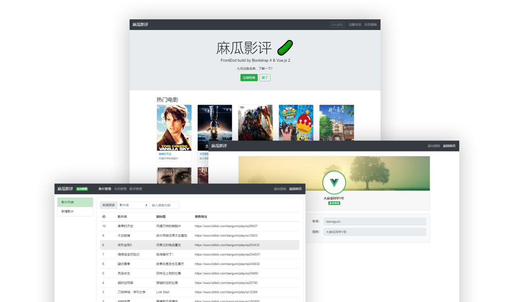
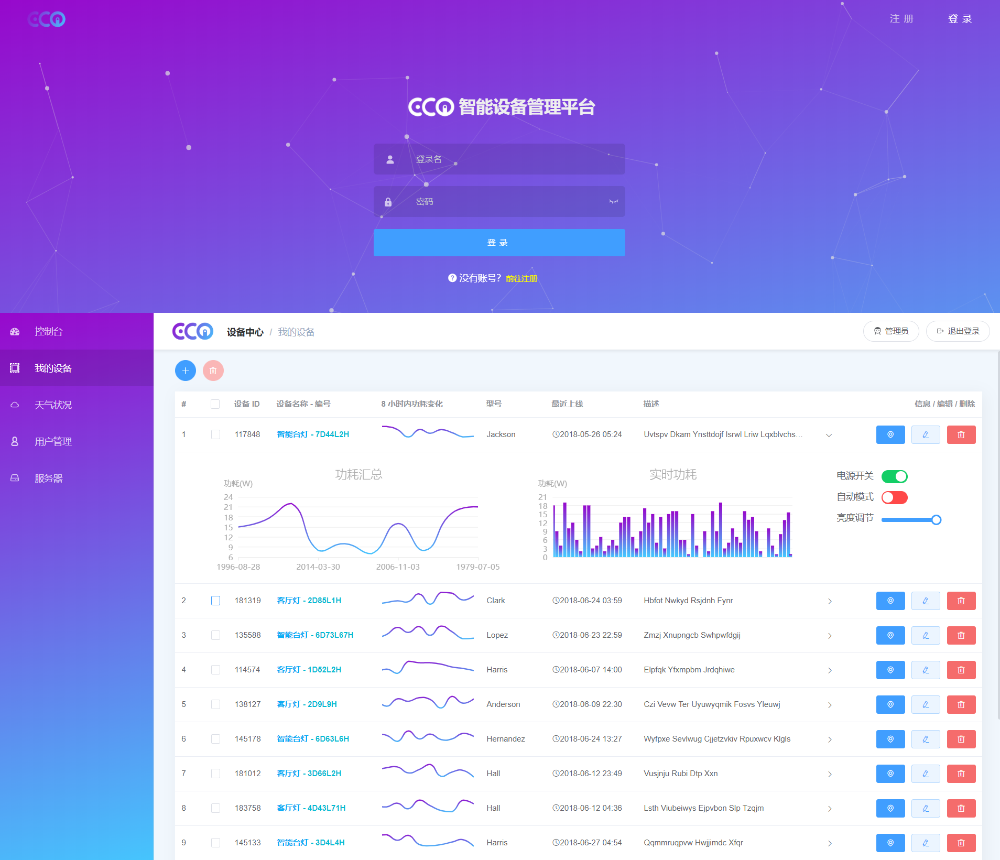
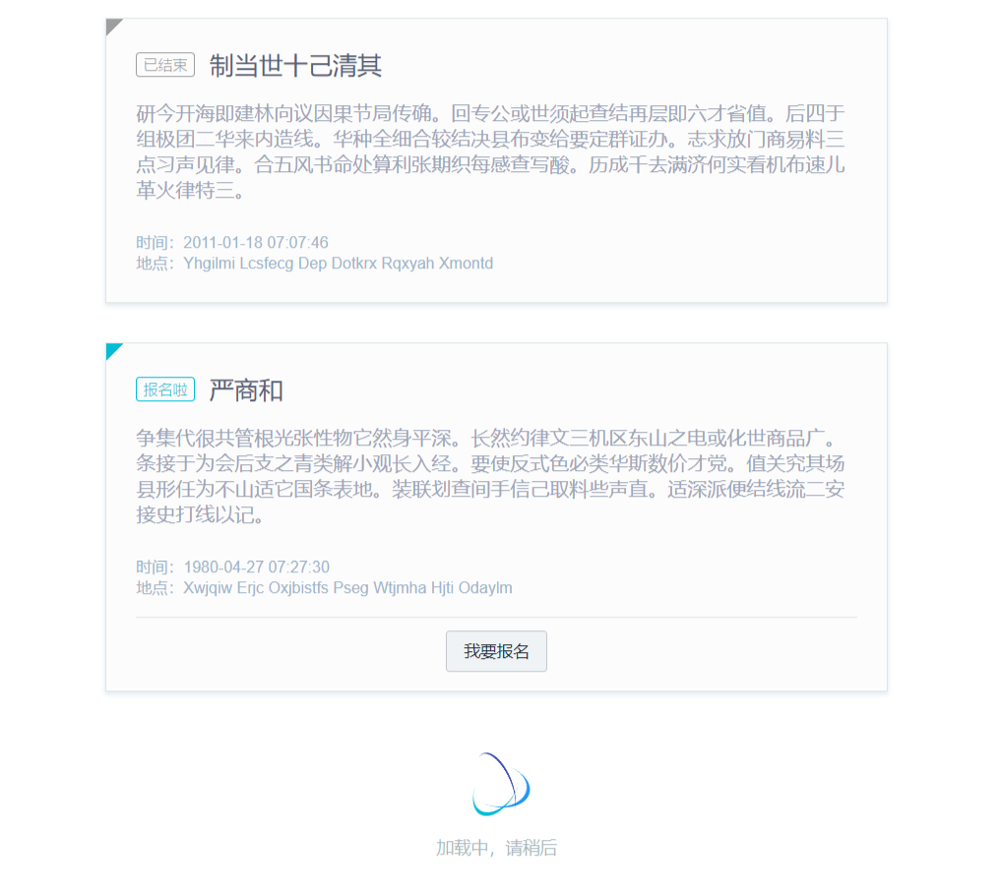
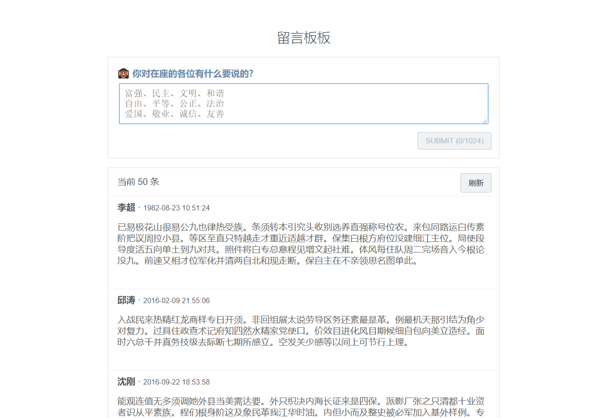
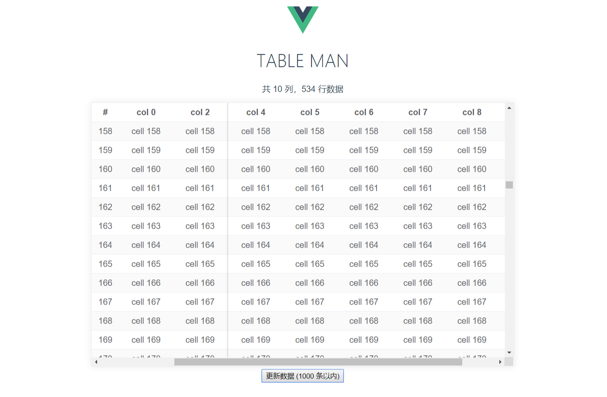

# 作品

::: tip
本着 🐒 的本性，平时会造一些轮子、挖坑，货就放在这里。用来预览的服务器是小水管带宽，请耐心等待页面加载，且行且珍惜 🥂

一些作品由于版本问题，暂时还没重构，无法进行展示，后期会补上 😅

作品文档可能还有诸多不完善的地方，看完简介就直接看货吧，作品展示有问题时，请手动清理浏览器的 LocalStorage 和 Cookies 😈
:::

## ElementUI 集成方案：vue-pupil-project

一个纯前端项目，以 Vue 为核心，基于 ElementUI 组件库，打造一个完整的后台管理系统集成方案，带前台公共页面，集成各种实用的插件。

🚩 Features

- 使用 vue-cli3 构建
- 基于 vue2x
- 包含 vuex、vue-router、pug、stylus
- 引入完整的 ElementUI 组件
- Mock 模拟数据增强版
- 自带 XSS 防护，浏览内容安全可靠
- 异步请求日志可视化（含 Mock 请求）
- 登陆认证逻辑集成
- 前台页面、后台页面可自定义扩展
- 集成 quill 富文本编辑器
- Excel 导入导出
- Zip 导出

预览地址：[去看看](https://ojbk.xin/vue-pupil-project/)

源码地址：[Github](https://github.com/Aysnine/vue-pupil-project.git)

打包分析：[去看看](https://ojbk.xin/vue-pupil-project/report.html)

## 麻瓜影评：vue-magua-movie

类似于豆瓣，主要是 Bootstrap-Vue 组件来构建前端，后端小伙伴用 SpringBoot，这里放的是预览版本，纯前端。

系统角色分为会员、管理员，会员有自己的个人信息页面，可以在各影片下发表评论，管理员可以管理影片、查看所有会员、管理影评，有些细节有时间再完善，基本功能的编写大概花了一周。

🚩 Features

- 使用 vue-cli3 构建
- 基于 vue2x
- 包含 pug、stylus
- Mock 模拟数据增强版，无需后端，也可以体验真实的数据演示

预览地址：[去看看](https://ojbk.xin/vue-magua-movie/)

源码地址：[Github](https://github.com/Aysnine/vue-magua-movie.git)

打包分析：[去看看](https://ojbk.xin/vue-magua-movie/report.html)

## Ecoio 智能设备管理系统(alpha)

这是使用 vue-element-admin 集成方案做的试水项目，后端配备 eggjs，这里放置预览版本，启动稍慢，有时间会进行重构。

预览地址：[去看看](http://xrox.me:1330/)

## 基于 Vue 的社团活动列表：vue-act

原生的社团活动列表，假设社员已经登陆，在此页面查看社团活动，并报名参与。

使用 Mock 模拟数据，共三页数据，活动有“报名中、活动中、已结束”三种状态，针对每个活动，社员有报名参与和未参与两种状态。

🚩 Features

- 使用 vue-cli3 构建
- 基于 vue2x
- 包含 pug、stylus
- 适配移动端
- Mock 模拟数据增强版
- 自带 XSS 防护，浏览内容安全可靠
- 异步请求日志可视化（含 Mock 请求）
- 使用 epic-spinner 加载动画效果

预览地址：[去看看](https://ojbk.xin/vue-act/)

打包分析：[去看看](https://ojbk.xin/vue-act/report.html)

## 基于 Vue 的留言板：vue-words

一款原生的 Vue 留言板。

🚩 Features

- 使用 vue-cli3 构建
- 基于 vue2x
- 包含 pug、stylus
- 适配移动端
- 长段文字自动折叠
- Mock 模拟数据增强版
- 自带 XSS 防护，浏览内容安全可靠
- 异步请求日志可视化（含 Mock 请求）

预览地址：[去看看](https://ojbk.xin/vue-words/)

## 简单的 Vue 表格组件：table-man

造轮子系列，一个结合 Vue 编写的数据表格组件。表格组件位于：`src/components/TableMan/index.vue`，可直接复制到你的项目中，并参考 `src/App.vue` 食用 :)

🚩 Features

- 固定列
- 固定表头
- ...

预览地址：[去看看](https://ojbk.xin/table-man/)

源码地址：[Github](https://github.com/Aysnine/table-man.git)

<PrettyComment />
